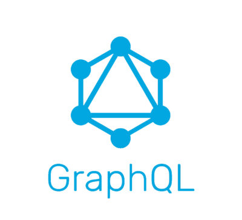
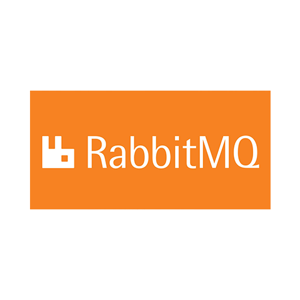
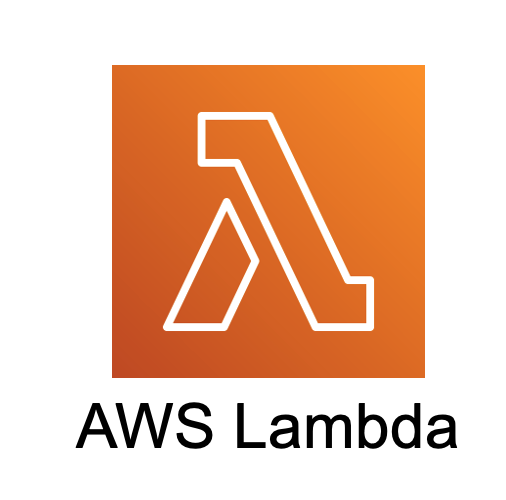
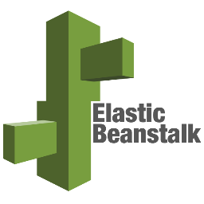
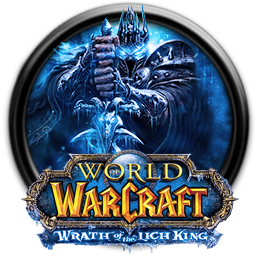

---

###### Welcome to my github.

I'm a full stack Javascript engineer with **5+ years** of experience.

I excel in data collection and in building large scale applications where
performance and scalability are of the utmost importance.

###### My stack includes:

-   Node.js (backend server code)
-   JavaScript (frontend dom manipulation)
-   React (frontend framework)
-   Material UI (ui library)
-   GraphQL (api query language)
-   PostgreSQL (database)
-   RabbitMQ (backend application communication)
-   AWS Lambda (microservice architecture)
-   AWS Elastic Beanstalk (hosting server and worker applications)
-   Docker (deploying stable images to lambda)

---

I spend my time developing awesome projects to help my company grow.

Nothing pleases me more than seeing something I've worked on succeed and be the
best that it can be!

My code style is a mix of functional with enough OOP to not be restrictive or
overbearing. I write my code for the human in mind, not the compiler. I strive
for my code to be modular, extendable, and efficient - all while being easy to
read and thus easy to maintain. .

Expand for a fun fact about me!

I ♡ classic wow

